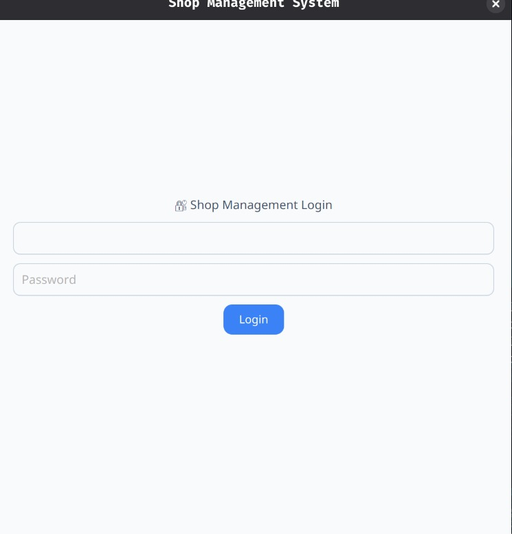
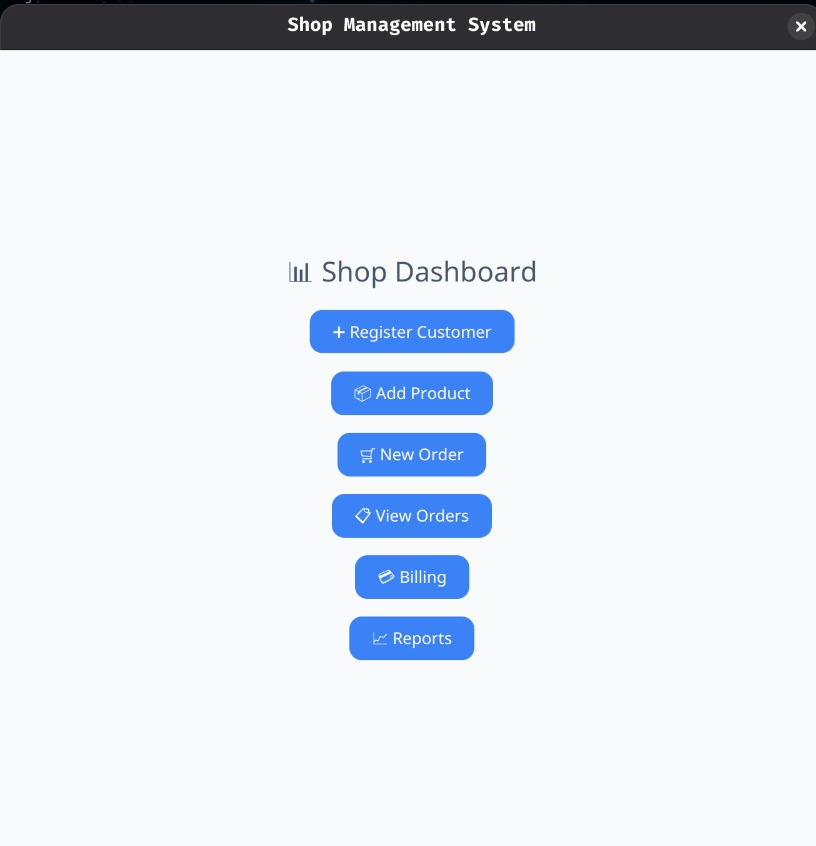
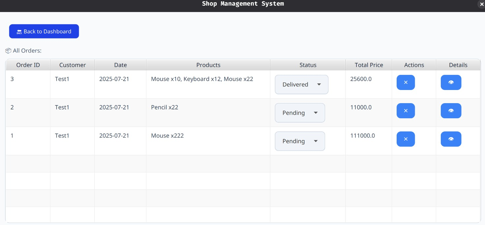

# ShopManagementSystem

A modular JavaFX + MySQL application following MVC architecture for managing shop operations (customers, products, orders, billing, and reports).

## Table of Contents

- [Introduction](#introduction)
- [Features](#features)
- [Architecture](#architecture)
- [Technology Stack](#technology-stack)
- [Database Schema](#database-schema)
- [Installation](#installation)
- [Key Design Patterns](#key-design-patterns)
- [Screenshots](#screenshots)
- [Contributors](#contributors)
- [License](#license)

## Introduction

The ShopManagementSystem is a desktop application designed to streamline and simplify the management of a retail shop. Built using JavaFX for the user interface and MySQL for data storage, this system provides essential tools for managing customers, products, orders, billing, and generating reports. The application follows a modular MVC architecture for maintainability and scalability.

## Features

- **User Authentication**: Secure login system
- **Customer Management**: Add/view customers
- **Product Inventory**: CRUD operations for products
- **Order Processing**: Create orders with multiple items
- **Billing System**: Generate detailed invoices
- **Sales Reporting**: View sales analytics and trends
- **Status Tracking**: Update order status (Pending/Shipped/Delivered)

## Architecture

The application follows a modular MVC (Model-View-Controller) architecture:

```
com.example.shopmanagement
├── models/    # Data entities
├── services/  # Business logic & DB operations (Controllers)
├── utils/     # Shared utilities
├── views/     # JavaFX UI screens (Views)
└── Main.java  # Application entry point
```

-   **Models**: Plain Java objects representing data entities.
-   **Views**: JavaFX UI screens built using Scene Builder.
-   **Services**: Classes containing business logic and database operations (acting as Controllers).
-   **Utils**: Shared utility classes for common tasks.

## Technology Stack

-   **Frontend**: JavaFX (Scene Builder)
-   **Backend**: Java 17
-   **Database**: MySQL
-   **Architecture**: MVC Pattern
-   **Dependency Management**: Maven

## Database Schema

Key tables:

-   `customers` (id, name, phone, email)
-   `products` (id, name, price, stock)
-   `orders` (id, customer_id, order_date, status)
-   `order_items` (id, order_id, product_id, quantity)

To set up the database, execute the `schema.sql` script located in the `src/main/resources` folder.

## Installation

1.  **Prerequisites**:

    -   Java 17 JDK
    -   MySQL 8.0+
    -   Maven

2.  **Setup Database**:

    ```sql
    CREATE DATABASE shop_management;
    USE shop_management;
    -- Run schema.sql from resources folder
    ```

3.  **Configure DB Connection**:

    Edit `DBConnection.java` with your MySQL credentials:

    ```java
    private static final String URL = "jdbc:mysql://localhost:3306/shop_management";
    private static final String USER = "your_username";
    private static final String PASS = "your_password";
    ```

4.  **Run Application**:

    ```bash
    mvn clean javafx:run
    ```

## Key Design Patterns

1.  **MVC Architecture**:

    -   Models: Plain Java objects
    -   Views: JavaFX screens
    -   Controllers: Service classes

2.  **Singleton Pattern**:

    -   `DBConnection` ensures a single database connection.

3.  **Service Layer**:

    -   Separates business logic from the UI.

## 🖼️ Screenshots

### Login Screen


### Dashboard


### Order Table


## Contributors

-   [Vaibhav](https://github.com/vaibhav092)

## License

This project is licensed under the MIT License - see the [LICENSE](LICENSE) file for details.